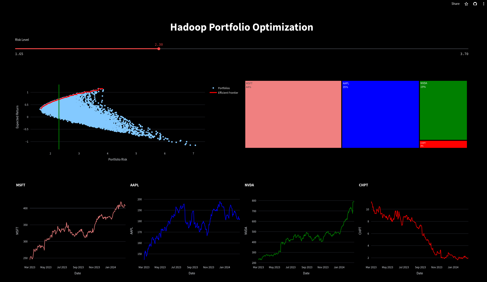

# Portfolio Optimization with Hadoop Map Reduce

This project demonstrates a simple implmentation of Markowitz's Modern Portfolio Theory using Hadoop Map Reduce to perform Mean-Variance Optimization on the following stocks:
- Microsoft (MSFT)
- Apple (AAPL)
- NVDA (NVIDIA)
- ChargePoint Holdings (CHPT)

The results of this portfolio optimization can be viewed in this interactive dashboard:
- https://hadoop-portfolio.streamlit.app/


This data pipeline was created using Hadoop Map Reduce in Java and Maven was used to manage the dependencies, and Hive was used to examine intermediate results from the various jobs. The data pipeline on an AWS Elastic Map Reduce Cluster with Core Hadoop installed on AWS Linux. The data pipeline consisted of the following steps:
1. Downloading the stock data from Yahoo Finance
2. Generate portfolio weights
3. Calculate the Mean Return of each stock
4. Join the portfolio weights with the mean returns
5. Calculate the Product of the Weights and the Mean Returns
6. Calculate the Expected Return of the Portfolios
7. Join the Returns and the Mean Returns
8. Calculate the Difference between the Returns and the Mean Returns
9. Perform a Self-Join on the Differences
10. Calculate the Product of the Differences
11. Calculate the Covariance (before dividing by n - 1)
12. Count the number of rows
13. Finishing Calculating the Covariance
14. Self Join the Weights with themselves
15. Join the Weights with the Covariances
16. Calculate the Product of the Weights and the Covariances
17. Calculate the Risk and the Portfolios
18. Join the Expected Returns with the Risk
19. Load the Expected Returns, Risk, Weights, and Stock Data onto MongoDB for use in the dashboard.


### Usage
The data pipeline was run on the February 28th, 2021 and the data was downloaded from Yahoo Finance using python. AWS Elastic Map Reduce was used to run this pipeline since it already has all the necessary Hadoop dependencies installed. The following bash script can be used to run the pipeline:
```bash
./run_pipeline.sh
```

### Resources
- https://medium.com/@financialnoob/introduction-to-portfolio-optimization-and-modern-portfolio-theory-101f663829c4
