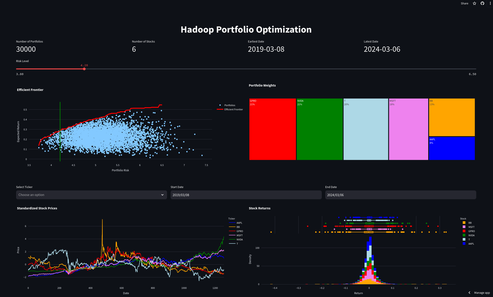

# Portfolio Optimization with Hadoop Map Reduce

This project demonstrates a simple implmentation of Markowitz's Modern Portfolio Theory using Hadoop Map Reduce to perform Mean-Variance Optimization on the following stocks:
- Microsoft (MSFT)
- Apple (AAPL)
- NVDA (NVIDIA)
- ChargePoint Holdings (CHPT)

The results of this portfolio optimization can be viewed in this interactive dashboard:
- https://hadoop-portfolio.streamlit.app/


This data pipeline was created using Hadoop Map Reduce in Java, and the

### Usage
The data pipeline was run on the February 28th, 2021 and the data was downloaded from Yahoo Finance using python. AWS Elastic Map Reduce was used to run this pipeline since it already has all the necessary Hadoop dependencies installed. The following bash script can be used to run the pipeline:
```bash
./run_pipeline.sh
```

### Resources
- https://medium.com/@financialnoob/introduction-to-portfolio-optimization-and-modern-portfolio-theory-101f663829c4
